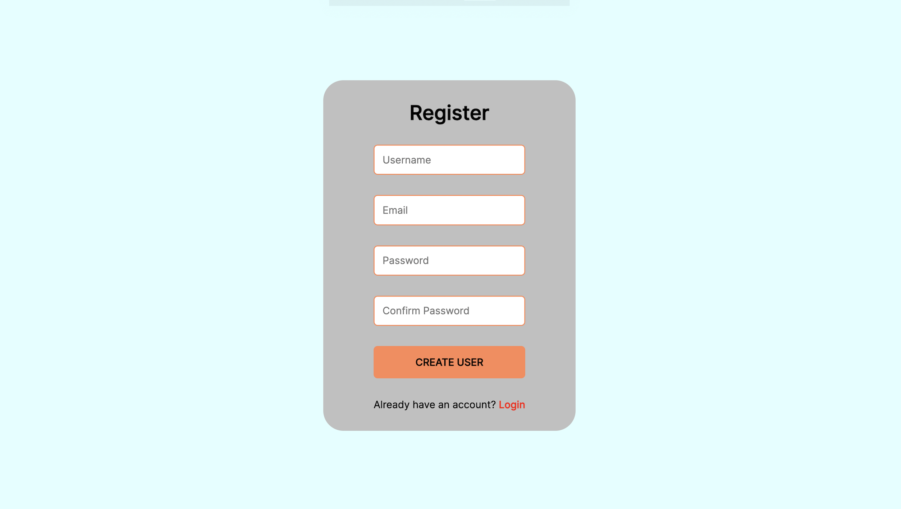
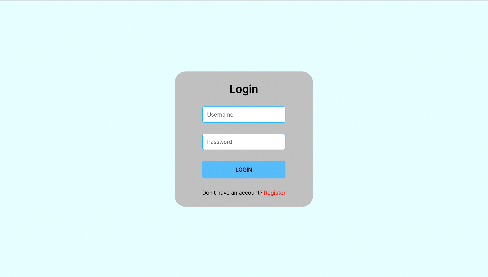
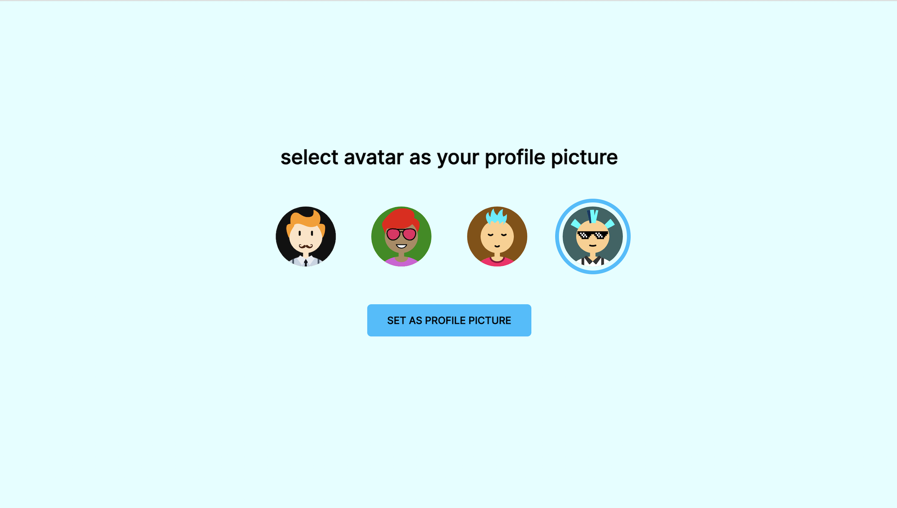
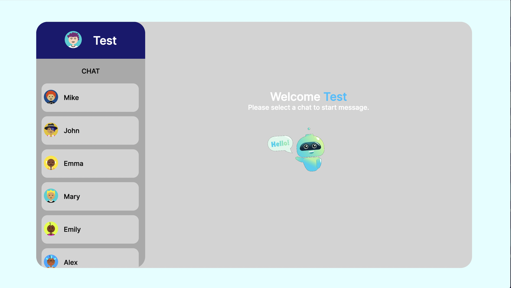
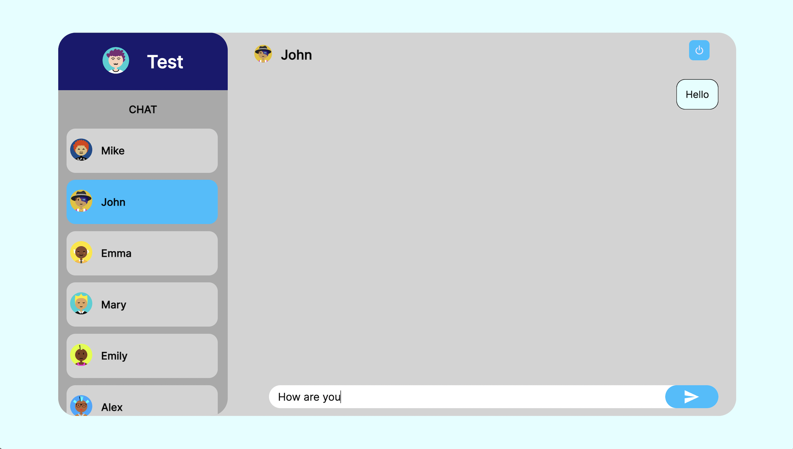

 

# Chat-app
 
 

## Register page

 
 

## Login page

 
 

## Selection page

 
 

## Chat page

 

 

 

# DESCRIPTION
## ABOUT THE PROJECT
This chat app allows people to communicate with their friends in real-time, enabling them to exchange text messages between individuals.

 
 

# TECHNOLOGIES
 
・ JavaScript 
・ Node.js 
・ React.js 
・ MongoDB 
・ CSS 

 
 

# REFERENCES
React-bootstrap 
https://react-bootstrap.netlify.app/ 
